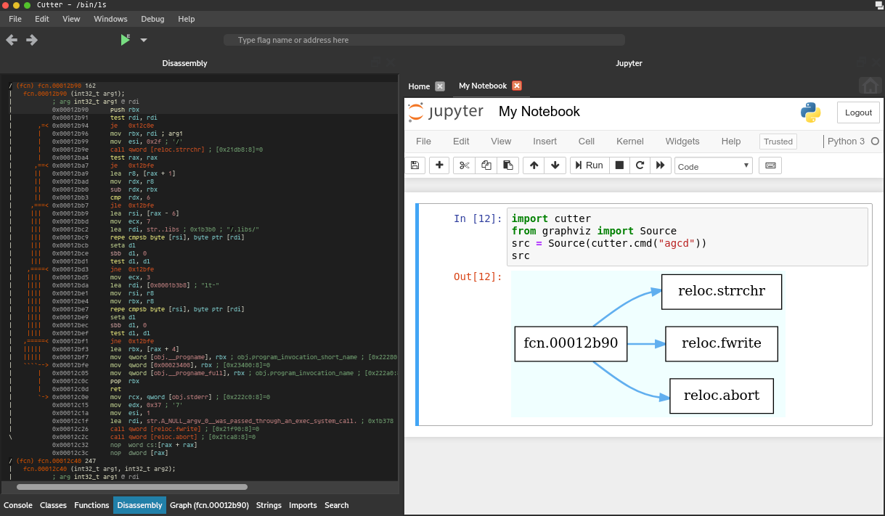

# Jupyter Plugin for Cutter



## Installation

First, install jupyter, so the Python interpreter used by Cutter can find it:
```
pip install jupyter
```

Then, check the plugins path of Cutter by looking into Edit -> Preferences -> Plugins
and copy or symlink the subdirectory `cutter_jupyter` from this repository into the `plugins/python` subdirectory.


## MacOS installation pre-requirements:
Install exact version of Python: 3.6.8
```
brew install pyenv
pyenv install 3.6.8
```

This will install python to /Users/USER/.pyenv/versions/3.6.8/bin/python3
Next, we need to downgrade SSL lib to version 1.0.0 with the following commands:
```
brew uninstall openssl
brew uninstall openssl
brew install https://github.com/tebelorg/Tump/releases/download/v1.0.0/openssl.rb
```
Yes, uninstall twice.

At this moment we are ready to install Jupyter, so the Python interpreter used by Cutter can find it:
```
/Users/USER/.pyenv/versions/3.6.8/bin/python3 -m pip install jupyter
```


